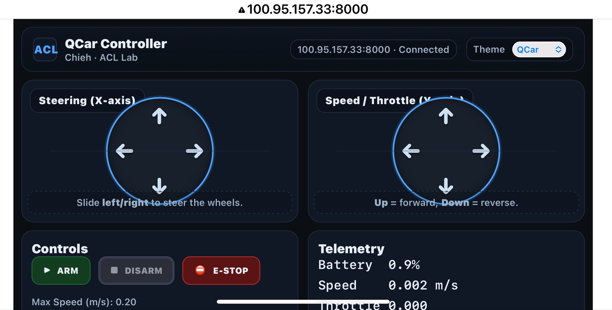
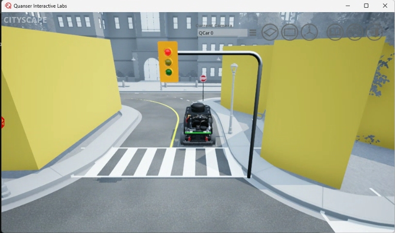
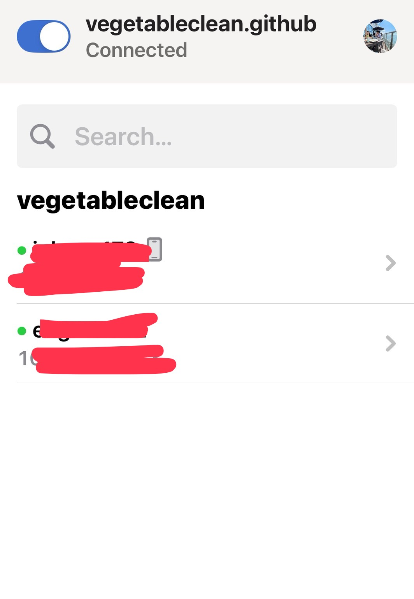

# 🚗 QCar TouchDrive  
**Designed by Chieh Tsai (Emery) · Autonomic Computing Lab (ACL), University of Arizona**

> Control your QCar from your phone — secure, fast, and intuitive.  
> Built for researchers, designed for everyone.



---

## 🧩 How It Works
The QCar TouchDrive app connects your phone directly to the Quanser QCar — either physical or virtual — using a real-time WebSocket interface.  
With Tailscale, you can securely control your vehicle across networks, even from outside your local lab.

<div align="center">

<table>
<tr>
<td align="center" width="50%">
<br>
<b>QCar Virtual Lab Demo</b>
</td>
<td align="center" width="50%">
<br>
<b>Tailscale Private Networking</b>
</td>
</tr>
</table>

</div>

```
[Phone Controller] ⇄ [WebSocket Server] ⇄ [QCar / Virtual Lab]
```

---

## ✨ Key Features

- 🎮 Dual-joystick mobile control (steer + throttle)
- 🔋 Live battery, speed, and telemetry readout
- 🧠 Adjustable control gains, deadzones, and smoothing
- 🌐 Secure remote access through **Tailscale**
- 📱 Add to Home Screen for native-like full-screen UX
- ⚡ Optimized for mobile landscape display

---

## 🚀 Quick Start (Private via Tailscale)

### 1) Install Python dependencies (server)
```bash
python -m pip install --upgrade pip
pip install aiohttp numpy
# pal is part of Quanser/QLabs environment; ensure it's installed and licensed
```

### 2) Install & sign in to Tailscale (both server & phone)
- Download: https://tailscale.com/download  
- Sign in on **both** devices with the same account.

### 3) Run the controller server
```bash
python task_task_manual_drive_phone.py --host 0.0.0.0 --port 8000 --rate 50
```

### 4) Open it on your phone (via Tailscale)
```text
http://<SERVER_TAILSCALE_IP>:8000
```
Then rotate your phone to **landscape** and drive.

---

## 🕹️ Controls Overview

| Control | Description |
|----------|--------------|
| **ARM** | Enables motion |
| **DISARM** | Disables motion (resets throttle/steer) |
| **E-STOP** | Emergency stop |
| **Max Speed (m/s)** | Caps max linear velocity |
| **Steering Gain** | Adjusts steering response |
| **Deadzone** | Ignores small joystick drift |
| **Smoothing** | Adds command filtering |

---

## ⚙️ Command-line Options

```bash
python task_task_manual_drive_phone.py   --host 0.0.0.0   --port 8000   --rate 50   --log manual_drive_log.csv   --readmode 0
```

---

## 🔒 Security Notes

- With **Tailscale**, your connections are encrypted and private.
- Only authorized tailnet devices can access the controller.
- Optionally, add a WebSocket auth token for shared deployments.

---

## 🧪 Data Logging

The server logs every command and telemetry event to CSV for experiments and audits.

```
Timestamp, LinearSpeed_mps, Battery_pct, Throttle_cmd, Steering_cmd, Armed, EStop
```

---

## 🙏 Credits & Citation

Developed by **Chieh Tsai (Emery)**  
Autonomic Computing Lab (ACL) — University of Arizona  
Advisor: **Prof. Salim Hariri**  

Based on and extended from the official **Quanser QCar manual_drive.py** codebase.  
Special thanks to **Quanser Inc.** for their foundational QCar platform and API.

Cite as:  
> Tsai, C. (2025). *QCar TouchDrive: A Mobile Dual-Joystick Teleoperation Interface for Quanser QCar.* Autonomic Computing Lab, University of Arizona.

---

© 2025 Chieh Tsai · ACL Lab · University of Arizona
